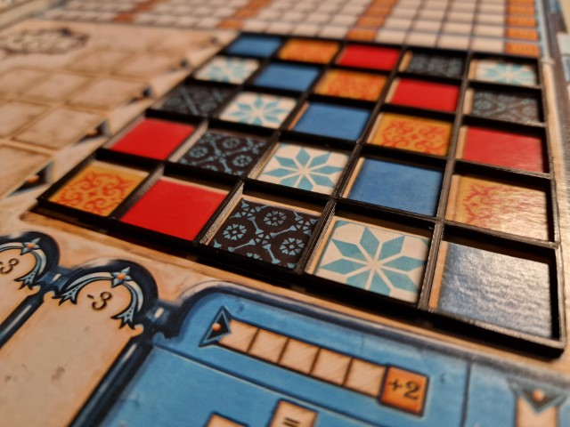

# Description
This grid has been designed to fit on the file field of the boardgame "Azul". Motivation for this design was, that the tiles get easily displaced if the board is touched. With this grid, the tiles should be kept better in place. 

# Printing/Material
Tested with PLA, no specific material recommendation. Cura estimates 1h time and 3g of material with default Settings on Ender3S1.

# Software
Designed using OpenSCAD version *2021.01*.
Sliced using Ultimaker Cura Version *5.3.1*.

# License
Attribution-ShareAlike International (CC BY-SA)

# Project state
Work in progress.

# Hosted on
- [GitHub](https://github.com/alos-source/3dObjects/tree/master/)
- [Thingiverse](https://www.thingiverse.com/thing:6675007)
- [Printables](https://www.printables.com/de/model/923922-azulgrid)
