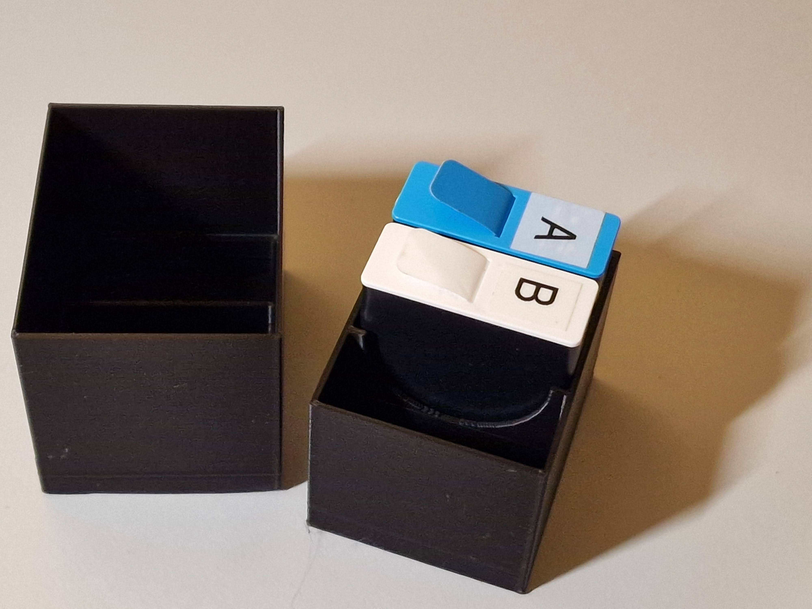

## Description
This holder was specifically designed for prismatic battery cells and is perfectly tailored for **GoPro HERO10/11/12** Black batteries *(14x34x42 mm)*. Thanks to adaptable parameters, you can easily use it for other battery sizes. Finally, organize and protect your spare batteries!

## Printing/Material
This holder has been successfully tested with PLA. There are no specific material recommendations, but for outdoor use, we recommend eye-catching colors like bright red, yellow, or orange so you can quickly find your batteries.

For printing the top and bottom simultaneously, Cura (with default settings on an Ender3S1) estimates a print time of 3 hours and 9 minutes and a material consumption of approximately 21g.

## Software
Designed using OpenSCAD version *2021.01*.
Sliced using Ultimaker Cura Version *5.3.1*.

## License
Attribution-ShareAlike International (CC BY-SA)

## Project state
Work in progress. At the moment only the versions for 2 and 3 Batteries and thinnest walls have been tested. Feel free, to give some feedback.

## Hosted on
- [GitHub](https://github.com/alos-source/3dObjects/tree/master/)
- [Thingiverse](https://www.thingiverse.com/thing:6021569)
- [Printables](https://www.printables.com/de/model/479755)
