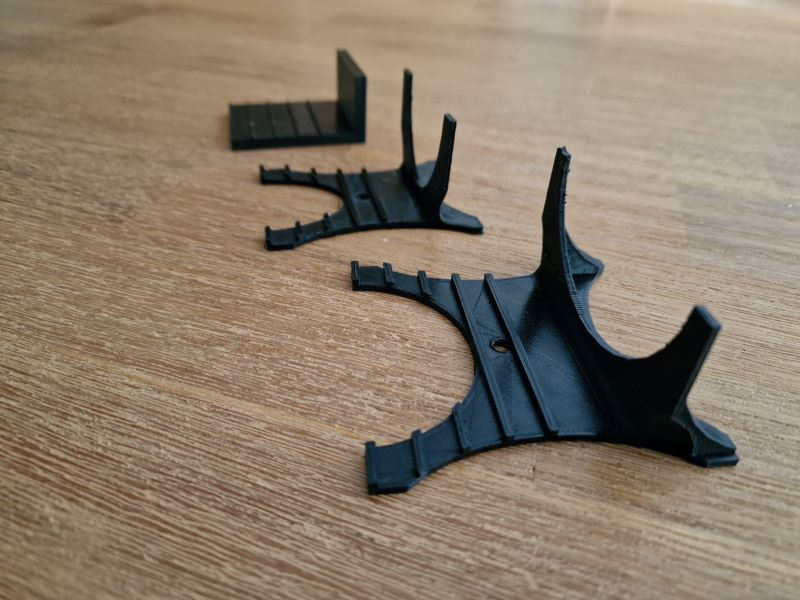

# Description
This Object, is developed in OpenSCAD, so the *.scad are the original sources. The STL-Files are exports for further processing. This folder contains several versions of the object:
- mirrorStand.scad: The Basemodel
- mirrorStandCustom.scad: A customizable version of the object. This is currently the main developement version.
- mirrorStandCustom2P.scad: A version that is split into 2 parts.

See [object.md](object.md) for further information.

# Photo
mirrorstand in action with an IKEA-Mirror:

Different versions of the mirror stand, from first version (in the background) to latest (in the forground):

# License
This work is licensed under the Creative Commons Attribution 4.0 International License. To view a copy of this license, visit http://creativecommons.org/licenses/by/4.0/ or send a letter to Creative Commons, PO Box 1866, Mountain View, CA 94042, USA.