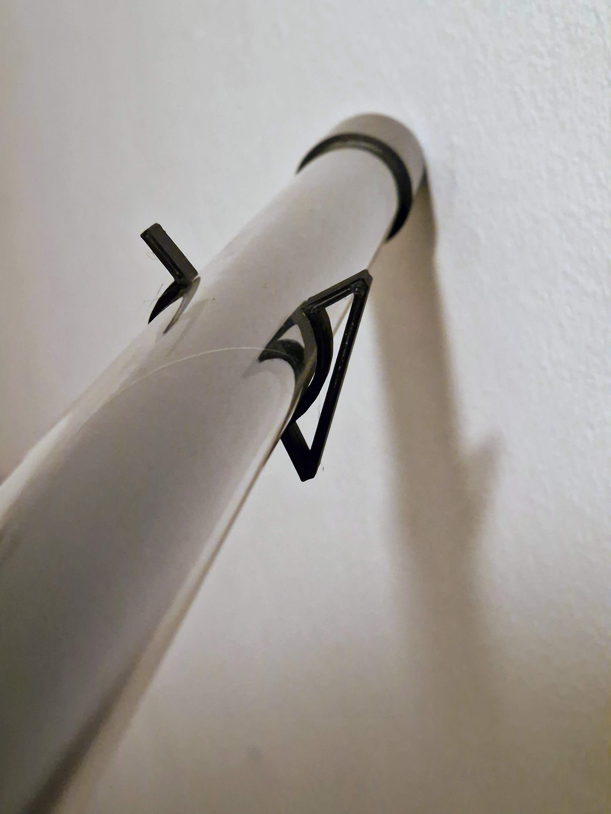

# Description
Designed to hold a neon tube light with 30mm diameter. With default settings,

# Material
Tested with PLA, no specific material recommendation. Cura estimates 30 minutes time and 3g of material with default Settings for printing

# Software
Designed using OpenSCAD version *2021.01*.
Sliced using Ultimaker Cura Version *5.3.1*.

# License
Attribution-ShareAlike International (CC BY-SA)

# Hosted on
- [GitHub](https://github.com/alos-source/3dObjects/tree/master/)
- [Thingiverse](https://www.thingiverse.com/thing:6033495)