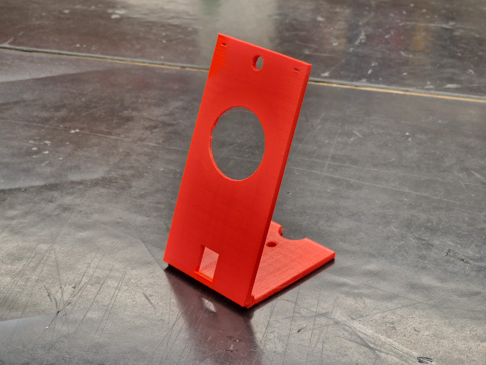
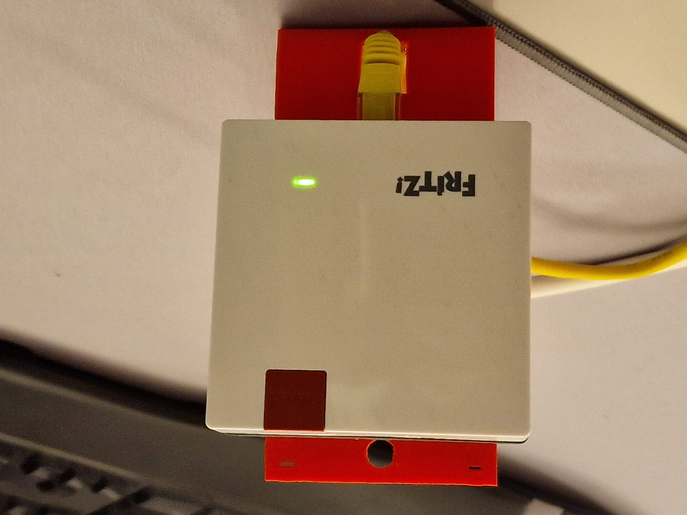
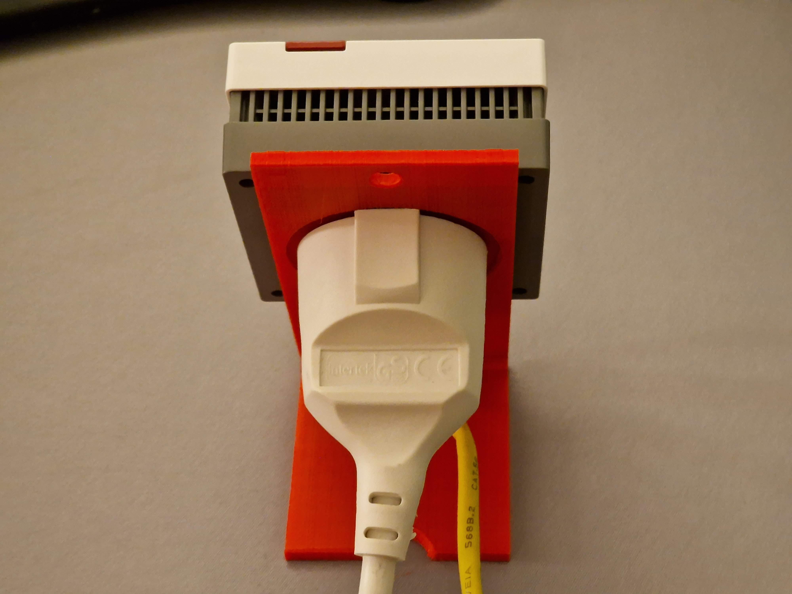

# Description
Designed to set up a european wall-socket wifi-repeater on a desk or a hanger. Upper holes can be used to hang it on the wall. Holes on the bottom can be used to screw it on a wall or upside down.

# Material
Tested with PLA, no specific material recommendation.

# Software
Designed using OpenSCAD version *2021.01*.
Sliced using Ultimaker Cura Version *5.3.1*.

# License
Attribution-ShareAlike International (CC BY-SA)

# Hosted on
- [GitHub](https://github.com/alos-source/3dObjects/tree/master/)
- [Thingiverse](https://www.thingiverse.com/thing:6306417)
- [Printables](https://www.printables.com/de/model/642202)
